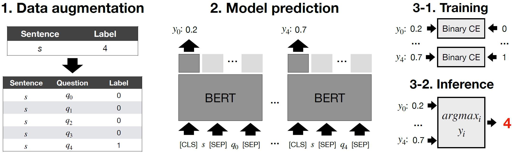

# Directed Sentiment Analysis in Political News

This repository provides a dataset and code for inferring sentiment relationships between political entities in news text.

## Problem

Given a sentence *s* that contains two entities *p* and *q*, the problem aims to detect the sentiment relation from *p* to *q* among five classes: neutral, *p* holds a positive or negative opinion towards *q*, and the reverse direction. 

For example, for a given sentence like ```Donald Trump emphatically blamed China for the coronavirus pandemic```, a model is required to understand Trump is the source of the negative sentiment toward China, by predicting a sentiment type among the five classes: **neutral**, **positive** (*p*->*q*), **positive** (*p*<-*q*), **negative** (*p*->*q*), and **negative** (*p*<-*q*). That is, the predicted class should be negative (*p*->*q*) for the above sentence.

## Data

We construct a dataset of 16,288 sentences by collecting news articles and crowdsourcing the annotation task. The class distribution is as follows. 

| Class | Count |
| --------------- | --------------- |
| Neutral | 10,604 |
| positive (*p*->*q*) | 1,656 |
| positive (*p*<-*q*) | 327 |
| negative (*p*->*q*) | 3,163 |
| negative (*p*<-*q*) | 478 |

We split the dataset into 13144, 1461, and 1623 instances for train, validation, and test set through stratified split. We also provide resampled versions of training sets for experimental purposes.

## Model

To solve the problem, we present an approach of utilizing pretrained BERT-like transformer models (e.g., RoBERTa). We transform the task into the multiple sub-tasks aiming for answering yes/no questions on whether a target sentiment is embedded in the text. The basic idea is we inquire an intelligent machine who can answer yes/no questions on whether a target sentiment exists and then combine the answers corresponding to the each sentiment class for making a final guess. 

We present the overall framework in the following figure. Technically, taking auxiliary input in BERT-like transformers enables implementing the intelligent machine by making a different prediction with the same sentence input, according to the question fed as additional input. 




## Example Usage

```bash
python dse2qa.py \
  --input_type T \
  --resample up
```
Required parameters:
- input_type: augmented input's type ("T(emplate)" or "P(seudo)") 
- resample: resampling method ("none", "up", "down")


## Reference

You can get more information on the dataset and method in [our paper](). 

You can use the resources for your projects by citing the paper.

```
@inproceedings{park2021directed,
  title={Who Blames or Endorses Whom? Entity-to-Entity Directed Sentiment Analysis in News Text},
  author={Park, Kunwoo and Pan, Zhufeng and Joo, Jungseock},
  booktitle={Proceedings of the 59th Annual Meeting of the Association for Computational Linguistics and the 13th International Joint Conference on Natural Language Processing},
  year={2021}
}
```
